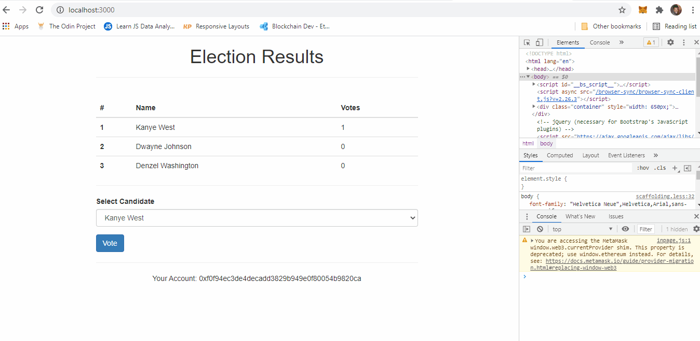

# Decentralized Elections
>This is a simple DApp for elections governed by a smart contract.

## Table of contents
* [General info](#general-info)
* [Screenshots](#screenshots)
* [Technologies](#technologies)
* [Setup](#setup)
* [Features](#features)
* [Status](#status)
* [Inspiration](#inspiration)
* [Contact](#contact)

## General Info
This is a simple v0 decentralized application for voting candidates in an election. This version simply allows one vote per account in a MetaMask wallet.

## Screenshot

## Technologies
* [Solidity](https://docs.soliditylang.org/en/v0.8.4/) - v0.5.0
* [Truffle](https://www.trufflesuite.com/docs/truffle/getting-started/installation) - v5.0.5
* [Ganache](https://www.trufflesuite.com/ganache) 
* [MetaMask](https://metamask.io/)
* Web3 - v1.3.5

## Installation
<!-- Describe how to install / setup your local environement / add link to demo version. -->
To setup this project (on a Windows machine):
1. Install the above technologies (Truffle, Ganache, Metamask)
2. Make Sure Ganache is running (Ganache is the local blockchain)
3. Connect your MetaMask wallet to Ganache:  
	a. Click the MetaMask browser extension    
	b. Click the Networks tab and select Custom RPC  
	c. Enter settings:   
		&nbsp;&nbsp;&nbsp;&nbsp;&nbsp;&nbsp;i.   Network Name => Ganache  
		&nbsp;&nbsp;&nbsp;&nbsp;&nbsp;&nbsp;ii.  New RPC URL (the RPC server on your running Ganache) => http://localhost:7545  
		&nbsp;&nbsp;&nbsp;&nbsp;&nbsp;&nbsp;iii. Chain ID => 1337 [Explanation](https://ethereum.stackexchange.com/questions/91072/setup-ganache-with-metamask-what-and-where-is-a-chain-id)  
	d. Click Save  
4. Select the newly added Ganache network and click the profile picture to reveal more settings
5. Select "Import Account"
6. Go to Ganache:  
	&nbsp;&nbsp;&nbsp;&nbsp;&nbsp;&nbsp;i.  Click the key icon on any address, which represent the voter (Ganache provides you with 10 accounts each prefunded with test Ether)  
	&nbsp;&nbsp;&nbsp;&nbsp;&nbsp;&nbsp;ii. Copy the private key
7. Go back to MetaMask, make sure the "Private Key" option is selected, paste the private key you copied and click import.

## Setup
<!-- Show examples of usage: -->
To run this project, install it locally using npm:  
`git clone https://github.com/icepaigez/Decentralized-Election.git project-name`  
`cd project-name`  
`npm install`   
`truffle migrate`  
`npm start`

## Features
List of features ready and TODOs for future development
* Single vote per account

To-do list:
* Add a time limit for accepting votes
* Add more restrictions for more credible elections - e.g. prevent change of account on the metamask wallet from voting, voter registration, etc
* Improve the UI

## Status
Project is: _in progress_, more features being developed.

## Inspiration
Project inspired by [@DappUniversity](https://twitter.com/DappUniversity).

## Contact
Created by [@shocotee](https://twitter.com/shocotee) - feel free to contact me!